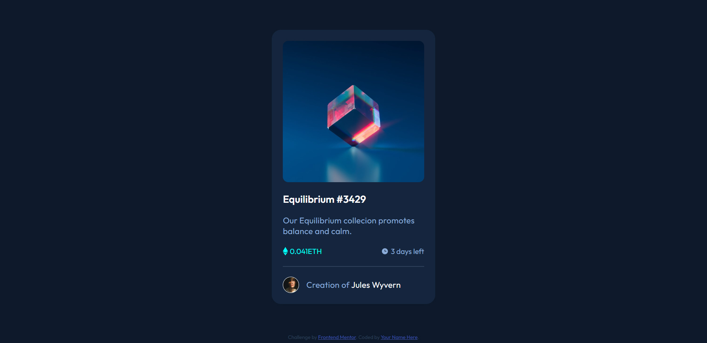

# Frontend Mentor - NFT preview card component solution

This is a solution to the [NFT preview card component challenge on Frontend Mentor](https://www.frontendmentor.io/challenges/nft-preview-card-component-SbdUL_w0U). Frontend Mentor challenges help you improve your coding skills by building realistic projects.

## Table of contents

- [Overview](#overview)
  - [The challenge](#the-challenge)
  - [Screenshot](#screenshot)
  - [Links](#links)
- [My process](#my-process)
  - [Built with](#built-with)
- [Author](#author)

## Overview

### The challenge

Users should be able to:

- View the optimal layout depending on their device's screen size
- See hover states for interactive elements

### Screenshot

### Links

- Solution URL: [Add solution URL here](https://github.com/felbart/fm-nft-preview-card)
- Live Site URL: [Add live site URL here](https://fm-nft-preview.netlify.app/)

## My process

First of all, I've build a figma prototype design, based on the preview image avaiable on the Frontend Mentor Challeng Hub.

The prototipe is avaible on figma

---

### Built with

- Semantic HTML5 markup
- CSS custom properties
- Flexbox

## Author

- Website - [Felipe Leite](https://www.felipeleite.me)
- Linkedin - [Felipe Leite](https://linkedin.com/in/felbart)
- Frontend Mentor - [@felbart](https://www.frontendmentor.io/profile/felbart)
- Twitter - [@felbart](https://www.twitter.com/felbart)
